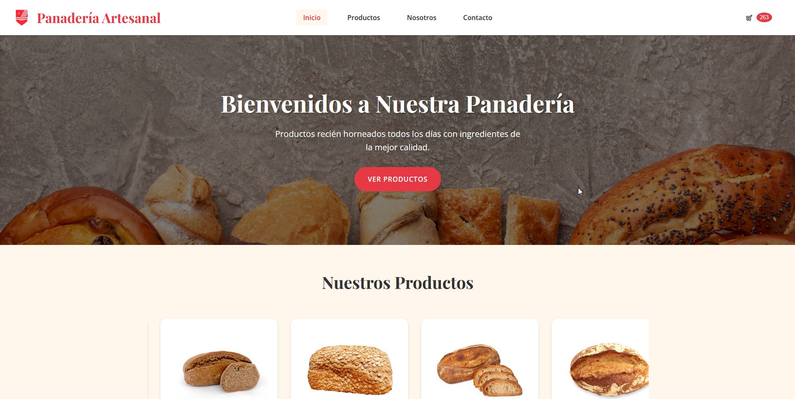
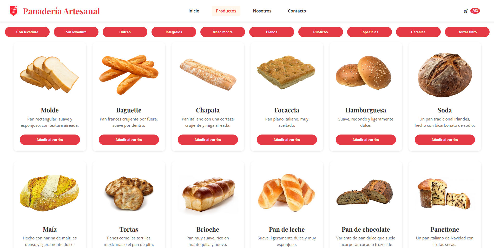
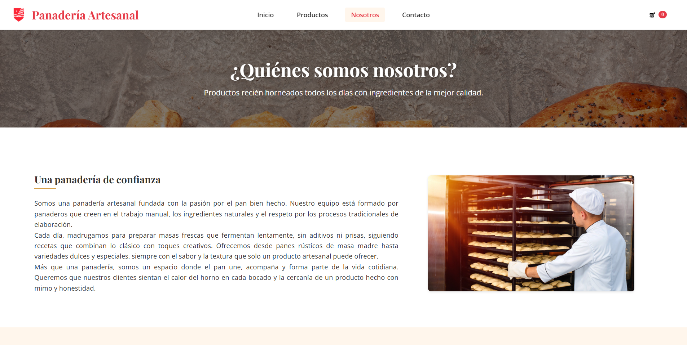
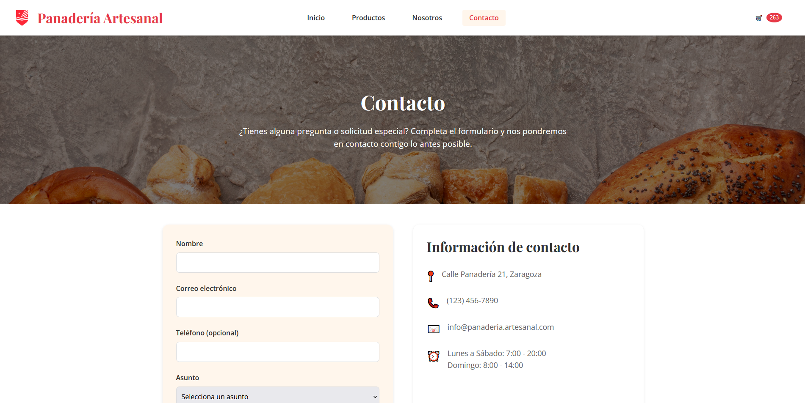

# Panadería Artesanal 🍞

**Proyecto final de Lenguajes de marcas y sistemas de gestión de información**

## Descripción

Este proyecto es una página web completa para una panadería artesanal, diseñada con un enfoque en la experiencia de usuario y la estética visual. La web muestra los diferentes tipos de pan y productos horneados de la panadería, permitiendo a los clientes ver el catálogo completo, filtrar por categorías, añadir productos al carrito y contactar con el negocio.

## Características Principales

- **Diseño Responsivo**: Adaptable a dispositivos móviles, tablets y ordenadores.
- **Catálogo de Productos**: Amplia variedad de panes y productos artesanales.
- **Carrusel Interactivo**: Navegación sencilla por los productos destacados.
- **Filtros de Categorías**: Búsqueda de productos por tipo (con levadura, sin levadura, dulces, etc.).
- **Carrito de Compra**: Funcionalidad para añadir productos al carrito.
- **Notificaciones**: Sistema de feedback visual para las acciones del usuario.
- **Formulario de Contacto**: Comunicación directa con la panadería.

## Capturas de Pantalla

### Página de Inicio


### Catálogo de Productos


### Página sobre Nosotros


### Formulario de Contacto


## Tecnologías Utilizadas

- **HTML5**: Estructura semántica y accesible.
- **CSS3**: Estilos modernos con variables CSS y diseño responsive.
- **JavaScript**: Interactividad avanzada y manipulación del DOM.

## Estructura del Proyecto

```
panaderia/
├── index.html              # Página principal
├── filtro.html             # Página de catálogo con filtros
├── formulario.html         # Página de contacto
├── nosotros.html           # Página sobre nosotros
├── styles/                 # Archivos CSS
│   ├── styles.css          # Estilos principales
│   ├── carousel.css        # Estilos del carrusel
|   ├── productos.css       # Estilos de productos
|   ├── nosotros.css        # Estilos sobre nosotros
│   ├── notificaciones.css  # Estilos de notificaciones
│   └── formulario.css      # Estilos específicos del formulario
├── scripts/                # Archivos JavaScript
│   ├── carousel.js         # Funcionalidad del carrusel
│   ├── carrito.js          # Funcionalidad del carrito
│   ├── filtro.js           # Funcionalidad de filtros
│   └── formulario.js       # Validación y envío del formulario
└── images/                 # Imágenes de productos y recursos
```

## Instalación y Uso

1. **Clonar el repositorio**:
   ```bash
   git clone https://github.com/pixocycaw/panaderia.git
   cd panaderia
   ```

2. **Abrir en navegador**:
   - Abre el archivo `index.html` en tu navegador preferido
   - También puedes usar un servidor local como Live Server en VS Code

3. **Navegación**:
   - Explora los productos en la página principal
   - Usa los filtros en la página de catálogo
   - Prueba a añadir productos al carrito
   - Rellena el formulario de contacto

## Funcionalidades Destacadas

- **Carrusel Infinito**: Navegación fluida por los productos sin interrupciones.
- **Notificaciones Apilables**: Sistema de notificaciones que permite visualizar múltiples mensajes.
- **Filtros Interactivos**: Filtrado de productos en tiempo real sin recargar la página.
- **Interfaz Intuitiva**: Diseño centrado en la experiencia de usuario.

---

Desarrollado con ❤ © 2025
